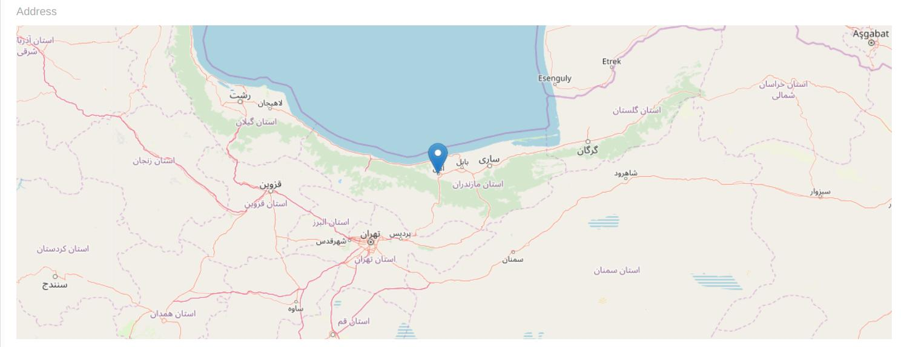

# Map Widget


A map marker input.

## Sample
```php
use Sanjab\Widgets\MapWidget;

$this->widgets[] = MapWidget::create('address', 'Address');
```
Each map widget a latitude field and a longitude field.
For above example you need two fields.

`address_lat` and `address_lng`.

If you do not use this naming style you can customize lat and lng with `latitudeName` and `longitudeName`.

Also recommended to use `$casts` to cast fields to number in your model.

```php
protected $casts = [
    'address_lat' => 'double',
    'address_lng' => 'double',
];
```

```php
$this->widgets[] = MapWidget::create('address')
    ->latitudeName('address_latitude')
    ->longitudeName('address_longitude');
```
Above example will use `address_latitude` and `address_longitude` instead.

## Properties

### latitudeName
`type: string`

latitude field name.

### longitudeName
`type: string`

longitude field name.
